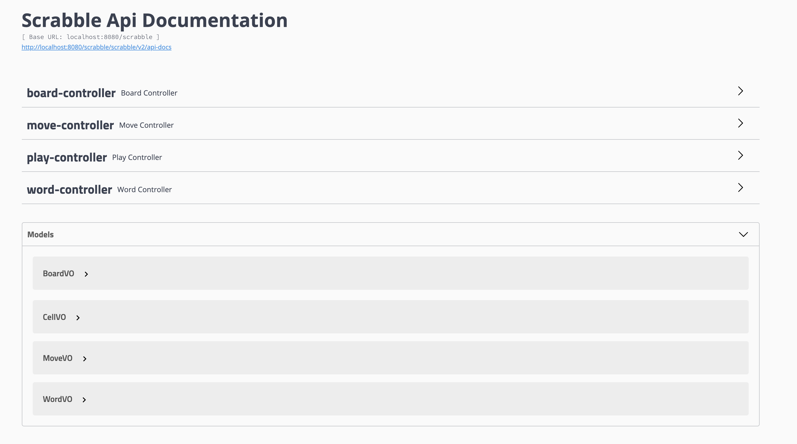

# Scrabble

Proje içerisin de kullanılan teknojiler : Java, Spring, Spring Rest, Hibernate, MongoDB, PostgreSql, H2, Docker, Log4J, JUnit, Mockito, Swagger, Mapstruct, Maven .


##Kurulum

Proje git adresi: 
```
git clone https://github.com/jackk88888/scrabble.git

```

Projeyi Tomcat, Wildfly v.s uyguluma sunucularında çalıştırabilirsiniz. Örnek olarak ben Tomcat 9.0 kullandım.
Aşşağıdaki adresten Tomcat'i indirebilirsiniz.

Tomcat:

```
https://tomcat.apache.org/download-90.cgi
```

Sunucu üzerinde her hangi bir konfigürasyon yapmadan, proje çalıştırılabilmekte. 

Proje içerisinde iki farklı ortam için , farklı konfigürasyon bilgileri yer almaktadır. 

 - Development ortamında proje H2 ve MongoDB ihtiyaç duymaktadır.
 - Production ortamında proje PostgreSql ve MongoDB ihtiyaç duymaktadır.

Sözlük datası, proje ilk çalıştırıldığında MongoDB'ye yazılmaktadır. 

Yazma işleminin daha hızlı ve farklı dil çevirileri de aynı kayıt üzerinde kolay şekilde tutulması için MongoDB kullandım.

Proje içerisinde Swagger' da kullanılmakta. Örnek rest çağrılarını swagger üzerinden yapabilirsiniz.

Swagger:
```
http://localhost:8080/scrabble/swagger-ui.html#
```
#### Swagger Screen


Proje içerisinde Docker da kullanıldı. İstenildiğinde docker yüklü makina üzerinde çalıştırılabilir.

```
   docker-compose up
```

Komutu çalıştırıldığında 'prod'  ortamında gerekli olan docker image çekilip proje başarılı şekilde ayağa kalkmakta.

##Proje

  Proje içerisinde varsayılan olarak 15x15 scrabble board'u  oluşturulabilmekte. 
  Board passive duruma alına bilmekte ve pasif durumdan aktif duruma alınamamakta. Kelimeler sadece aktif olan board eklenebilmekte.
  Board üzerine eklenecek ilk kelime board her hangi bir yerine eklebilebilmete , daha sonrasında eklenecek kelimeler daha önceki eklenenk kelime ile en az bir hücresi ortak olması gerekmektedir.
  Eklenmek istenen kelimeler sözlükte olup olmadığı kontrol edilmekte.
  Birinci kelimeden sonra eklenmek isteyen diğer kelimeler, eklenmek istenilen konumdaki yerlere komşu olan tüm hücreler kontrol edilip, sözlükte bulunan bir kelime olup olmadığı kontrol edilmekte.
  Sözlükte kelime bulunmadıysa tüm işlem geri alınmakta.
  Hangi boardda hangi kelimelerin eklendiği görülmekte.
  Hangi hareket sonrasındai Board üzerindeki harflerin dağılımı görüntülenebilmekte.
  
##Geliştirilebilir Noktalar

   - Unit testler daha kapsamlı yazılacak
   - Entegrasyon testleri yazılacak
   - Loglanan rest çağrıları ve diğer loglar, logstash ile birlikte elasticsearch yazılacak.
  